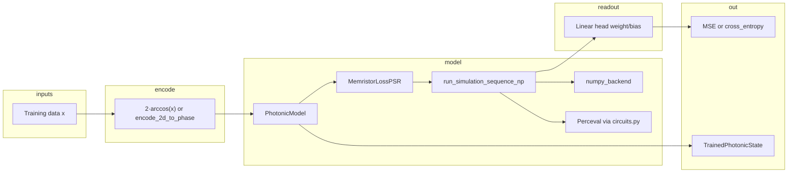

# UQ-QNN — LLM repository index (read-only orientation)

> **Audience:** An LLM (or human) arriving cold who must **understand and reason about** this repo without writing code unless explicitly asked.
>
> **Start here.** Follow links to source files for detail. Prefer this index + targeted file reads over whole-repo grep when possible.

---

## 1. What this project is

**UQ-QNN** trains **photonic quantum neural networks** on integrated circuits (Clements interferometer mesh, optional photonic memristors). Circuits are differentiable layers trained in **PyTorch** via the **Parameter-Shift Rule (PSR)**. The stack supports **regression** and **classification**, two simulation backends (**NumPy** fast path vs **Perceval** full SLOS), and **uncertainty quantification (UQ)** by noisy multi-pass forward evaluation.

**Core loop:**

```
Input x  →  phase encoding (typically 2·arccos(x))  →  photonic circuit  →  Born / coincidence probabilities
         →  linear readout head  →  loss (MSE or CE)  →  PSR gradients  →  Adam
```

**Package name / version:** `uq-qnn` `0.1.0` (`pyproject.toml`). **Python:** `>=3.13`. **Tooling:** [uv](https://docs.astral.sh/uv/) for env + lockfile.

---

## 2. How to use this index (read-only agent)

| Do | Don't |
|----|--------|
| Read `examples/TEMPLATE.py` and one example matching your task | Assume `main.py` exists (removed; see §15) |
| Treat `CONFIG` dicts as **fully explicit** (no hidden defaults in `Experiment`) | Pass legacy `input_state` as mode-index pairs `(j, k)` |
| Use `TrainedPhotonicState` for inference after training | Call `Experiment.predict()` with bare `theta` (deprecated) |
| Check `CHANGELOG.md` for recent breaking API changes | Trust `CLAUDE.md` alone if it disagrees with code (e.g. `simulation.py` → `src/simulation/`) |
| Run tests with `uv run pytest tests/` to validate understanding | Edit `reports/`, `misc/`, `playground/`, or notebooks unless asked |

**Suggested first reads (15–30 min):**

1. This file (overview)
2. `README.md` — user-facing API, config tables, hardware profiles
3. `examples/TEMPLATE.py` — experiment conventions
4. `src/experiment.py` — run lifecycle
5. `src/config.py` — `SimConfig`, validation, PSR photon counts
6. `CHANGELOG.md` (top ~100 lines) — latest breaking changes

---

## 3. Repository map

```
uq-qnn/
├── LLM_INDEX.md          ← you are here
├── README.md             ← primary human docs + config reference
├── CHANGELOG.md          ← API / behavior history (read before “fixing” old examples)
├── CLAUDE.md             ← short agent cheat sheet (may lag code slightly)
├── pyproject.toml        ← deps, Python version
├── uv.lock
│
├── src/                  ← all library code (import as `src.*` or `from src import …`)
│   ├── config.py         SimConfig, CircuitConfig, validate_sim_config
│   ├── experiment.py     Experiment context manager
│   ├── loss.py           PhotonicModel, TrainedPhotonicState, linear head
│   ├── training.py       train_pytorch_generic, train_pytorch
│   ├── autograd.py       MemristorLossPSR, photonic_psr_coeffs_torch
│   ├── simulation/       run_simulation_sequence_np, memristive state, UQ worker
│   ├── numpy_backend.py  vectorized Clements + coincidences
│   ├── circuits.py       Perceval circuit builders
│   ├── circuit.py        PhotonicCircuit (lightweight NumPy API)
│   ├── coincidence.py    N-fold channels, postselection, noise on outcomes
│   ├── clements_geometry.py  phase index ↔ MZI pair
│   ├── data.py           synthetic datasets, 2D encodings
│   ├── hardware.py       HardwareProfile, noise models
│   ├── utils.py          resolve_n_swipe, print_run_params
│   ├── logging_config.py structured logging
│   └── circuit_visualization.py
│
├── examples/             ← runnable experiments (preferred entry vs removed CLI)
│   ├── TEMPLATE.py       copy this for new experiments
│   └── old/              legacy / superseded scripts
│
├── tests/                ← pytest suite (ground truth for behavior)
├── reports/              ← generated run outputs (gitignored content)
├── misc/                 ← figures, design notes (e.g. n-fold coincidence note)
├── notebooks/            ← exploratory / not CI-gated
├── playground/           ← scratch code, not part of the package
├── scripts/              ← ad-hoc utilities
└── presentation/         ← LaTeX slides (repository overview)
```

---

## 4. Architecture (control flow)



**Two simulation backends** (`sim_backend` in config → `SimConfig.backend`):

| Backend | When | Implementation |
|---------|------|----------------|
| `numpy` | Default; non-memristive; memristive singles (optimized paths) | `src/numpy_backend.py`, `src/simulation/runner.py` |
| `perceval` | Memristor feedback needing full SLOS; agreement tests | `src/circuits.py` + Perceval |

**Training vs quick simulation:**

| Use case | Entry point |
|----------|-------------|
| Full experiment + reports + UQ | `Experiment` in `src/experiment.py` |
| Train without Experiment | `train_pytorch_generic` in `src/training.py` |
| Single circuit, no SimConfig training stack | `PhotonicCircuit` in `src/circuit.py` + `CircuitConfig` |

---

## 5. Module reference (symbols to know)

### `src/config.py`

- **`SimConfig`** — frozen dataclass; single object through simulation, autograd, training. Built via `SimConfig.from_experiment_config(dict)` or `from_dict`. Use `.replace(...)` for UQ passes.
- **`CircuitConfig`** — geometry + measurement only (used by `PhotonicCircuit`).
- **`validate_sim_config(cfg)`** — raises on inconsistent occupation / coincidence / class counts.
- **`psr_photon_counts_for_phases(sim_cfg, n_phase_params)`** — PSR uses **`sum(input_state)`** per phase (not `output_mode` alone).

Config key **`sim_backend`** maps to field **`SimConfig.backend`**.

### `src/experiment.py`

- **`Experiment(name, *, config, hardware=None)`** — context manager.
- **`exp.train(X, y)`** → `(TrainedPhotonicState, loss_history, PhotonicModel)`; applies `2 * np.arccos(X)` for 1D regression/classification inputs. **Auto-saves** `trained_state.json` and `loss_history.json` under `run_dir` (also listed in `run_summary.json` → `metrics` / `artifacts`).
- **`trained_state.predict(enc_phases)`** — head-aware inference.
- **`TrainedPhotonicState.load_json(run_dir / "trained_state.json")`** — reload a past run without retraining (must match saved `sim_cfg`).
- **`exp.run_uncertainty_analysis(trained_state, enc, n_passes, noise_std)`** → `{"mean", "std", "all_preds"}`; parallel `ProcessPoolExecutor`.
- **`exp.savefig(fig, name)`**, **`exp.save_metrics(dict)`** — additional artifacts under `reports/<slug>/<timestamp>/`.
- **`_REQUIRED_CONFIG_KEYS`** — every key must appear in `CONFIG` (see §7).

### `src/loss.py`

- **`PhotonicModel(nn.Module)`** — wraps `MemristorLossPSR` + trainable `theta` + linear **`head`** over full feature vector (all singles modes or all N-fold coincidence channels).
- **`TrainedPhotonicState`** — JSON-serializable `theta`, `head_weight`, `head_bias`, `sim_cfg`; `save_json` / `load_json`, `predict()`.

Training optimizes **features → head → loss**. Evaluation must use the head (not raw `target_mode` scalar simulation alone).

### `src/autograd.py`

- **`photonic_psr_coeffs_torch(n)`** — shift angles/coefficients; **2n** terms for photon count `n`.
- **`MemristorLossPSR`** — `torch.autograd.Function`; PSR on phases, finite differences on memristor weights.

### `src/simulation/` (package; not a single `simulation.py` file)

- **`run_simulation_sequence_np(theta, enc_phases, sim_cfg, ...)`** — main NumPy orchestrator (`runner.py`).
- **`run_simulation_sequence`** — Perceval path when backend requires it.
- **`uncertainty_forward_pass`** — multiprocessing worker for UQ.
- **`MemristiveState`** — memristor history buffer (`memristive.py`).

### `src/numpy_backend.py`

- **`clements_unitary`**, **`run_vectorized_non_memristive`**, **`run_fast_memristive_singles`**, **`slos_2photon_numpy`**, batch PSR helpers.
- Analytic Clements mesh; 2×2 permanents / Ryser for multi-photon paths.

### `src/circuits.py`

- **`build_circuit`**, **`clements_circuit`**, **`memristor_circuit`**, **`encoding_circuit`** — Perceval construction (lazy import).

### `src/circuit.py`

- **`PhotonicCircuit`** — `singles_batch`, `coincidences`, `unitary`; uses **`CircuitConfig`** + occupation-vector semantics.

### `src/coincidence.py`

- **N-fold readout:** `nfold_channel_count`, `nfold_working_detector_tuples`, `probs_to_nfold_coincidences`, `postselect_measurement`, `apply_noise_to_outcomes`.
- Legacy pair indexing: `get_cc_mode_pairs`, `mode_pair_to_cc_index` (full mesh); training stack prefers **working-detector N-fold** channels.

### `src/data.py`

- **`get_data(n, sigma, function_name)`** — 1D regression synthetics (`quartic_data`, `gaussian_bump_data`, …).
- **`get_classification_data`**, **`get_two_moons_data`**, **`encode_2d_to_phase`**, **`encode_2d_to_phases_multi`**.

### `src/hardware.py`

- **`HardwareProfile`**, built-ins **`IDEAL`**, **`LAB_6MODE`**, **`NOISY_PROTOTYPE`**.
- Noise: `GaussianNoise`, `ShotNoise`, `DarkCountNoise`, `CompositeNoise`.
- **`RealHardwareBackend`** — placeholder (`NotImplementedError`).

### `src/training.py`

- **`train_pytorch_generic(*, sim_cfg, X, y, lr, epochs, seed, ...)`** → same 3-tuple as `Experiment.train`. **`seed`** fixes NumPy mesh init and PyTorch linear-head init.
- **`gradient_check`** — PSR sanity check.

### `src/__init__.py`

Lazy exports: `from src import Experiment, PhotonicModel, run_simulation_sequence_np, …` — see `_ATTR_EXPORTS` for the full public surface.

---

## 6. Circuit architectures

### Clements mesh (default)

- Phase count: **`n_modes * (n_modes - 1)`**.
- Set `memristive_phase_idx=None`.
- Singles: `sum(input_state) == 1`.
- Coincidence: `sum(input_state) >= 2`, non-empty **`working_detectors`**.

### Memristor circuit

- Set **`memristive_phase_idx`** and **`memristive_output_modes`**.
- **`memory_depth`** controls feedback history.
- NumPy backend supports optimized **singles** memristive paths; full coincidence + memristor may need Perceval or specific runner branches (see tests + `CHANGELOG.md`).

---

## 7. Configuration contract (`Experiment` / `SimConfig`)

**No hidden defaults** in `Experiment`. The script’s `CONFIG` dict must include every key in `_REQUIRED_CONFIG_KEYS` (`src/experiment.py`) plus experiment-only keys your script uses (`n_data`, `sigma_noise`, `unc_n_passes`, …).

### Required keys (simulation stack)

| Group | Keys |
|-------|------|
| Circuit | `n_modes`, `input_state`, `encoding_phase_idx`, `photon_distinguishability`, `target_mode`, `memristive_phase_idx`, `memristive_output_modes` |
| Measurement | `output_mode` (`"singles"` \| `"coincidence"`), `working_detectors`, `noise_std` |
| Simulation | `n_samples`, `memory_depth`, `n_swipe`, `swipe_span`, `sim_backend`, `seed` |
| Task | `loss_type` (`"mse"` \| `"cross_entropy"`), `n_classes` |
| Training | `lr`, `epochs` |

Full semantics: **`README.md` § Config reference**.

### Critical invariants

1. **`input_state`** — length-`n_modes` **Fock occupation vector** (non-negative ints). **Not** a pair of mode indices `(j, k)`. Migration hints: `coincidence.migration_hint_legacy_input_state_pair`.
2. **PSR photon count** = **`sum(input_state)`** for each trainable mesh phase.
3. **Coincidence classification** — `n_classes` = **C(W, N)** with `W = len(working_detectors)`, `N = sum(input_state)`; channel order = lexicographic `combinations(sorted(working_detectors), N)`.
4. **Encoding** — `Experiment.train` uses **`2 * arccos(x)`** for 1D inputs in `[0, 1]`; test/UQ paths must encode consistently.
5. **Linear head** — feature dimension = all singles modes or full coincidence channel vector; `target_mode` alone does not define training readout for coincidence CE.

---

## 8. Uncertainty quantification (UQ)

`Experiment.run_uncertainty_analysis(trained_state, encoded_test, n_passes=..., noise_std=...)`:

- Adds Gaussian noise to phase parameters each pass.
- Returns mean/std over passes (regression: per-point std; classification: per-class probabilities).
- Uses **`trained_state`** so the **learned head** is applied on every pass.
- Parallelism: up to `os.cpu_count()` workers.

---

## 9. Examples catalog

Copy pattern: **`examples/TEMPLATE.py`**.

| Script | Topic |
|--------|--------|
| `simple_regression.py` | Quartic regression + UQ |
| `simple_classification.py` | Binary classification + UQ |
| `multi_class_classification.py` | 3-class Clements |
| `two_moons_classification.py` | 2D moons + phase encoding |
| `coincidence_regression.py` | Two-photon coincidence regression |
| `coincidence_regression_memristor.py` | Memristor + coincidence + NumPy |
| `coincidence_gaussian_bump.py` | Static vs memristive coincidence |
| `coincidence_hard_function_search.py` | Preset sweep harder targets |
| `function_comparison.py` | Synthetic function benchmark |
| `function_memristor_comparison.py` | Memristor vs standard across functions |
| `hardware_profile_comparison.py` | IDEAL vs noisy profiles |
| `benchmark_memristive_backend.py` | Memristive NumPy vs legacy loop |
| `examples/old/*` | Superseded; do not treat as canonical API |

Run: `uv run python examples/<script>.py`

Outputs: `reports/<experiment_slug>/<timestamp>/` (`run.log`, `run_summary.json`, `trained_state.json`, `loss_history.json`, figures).

---

## 10. Tests catalog (behavioral spec)

| File | Covers |
|------|--------|
| `test_sim_config_validation.py` | Config / occupation / coincidence rules |
| `test_circuits.py` | Perceval circuit build |
| `test_autograd.py` | PSR coefficients and gradients |
| `test_training.py` | Training loop, return signatures |
| `test_experiment.py` | Experiment lifecycle, trained state, UQ, auto-saved run artifacts |
| `test_photonic_circuit.py` | `PhotonicCircuit` API |
| `test_coincidence_regression_numpy_backend.py` | Coincidence regression NumPy |
| `test_memristive_numpy_backend.py` | Memristive paths |
| `test_numpy_perceval_agreement.py` | Backend agreement |
| `test_hardware.py` | Noise profiles |
| `test_mauser_encoding.py` | Encoding edge cases |
| `test_imports.py`, `test_package_import_hygiene.py`, `test_simulation_backend_imports.py` | Import surface |

```bash
uv sync
uv run pytest tests/
uv run ruff check .
```

---

## 11. Task routing (“I need to …”)

| Goal | Read first |
|------|------------|
| Add a new experiment script | `examples/TEMPLATE.py`, `src/experiment.py` |
| Understand config errors | `src/config.py` (`validate_sim_config`), `tests/test_sim_config_validation.py` |
| Debug wrong gradients | `src/autograd.py`, `psr_photon_counts_for_phases`, `CHANGELOG` PSR notes |
| Coincidence / N-fold semantics | `src/coincidence.py`, `misc/n_fold_coincidence_design_note.md` |
| Fast forward pass without training | `src/circuit.py`, `README.md` § PhotonicCircuit |
| Memristor behavior | `src/simulation/memristive.py`, `src/simulation/runner.py`, `test_memristive_numpy_backend.py` |
| Hardware noise | `src/hardware.py`, `examples/hardware_profile_comparison.py` |
| What changed recently | `CHANGELOG.md` (top entries) |
| Public API surface | `src/__init__.py` |

---

## 12. Key dependencies (why they appear)

| Dependency | Role |
|------------|------|
| `torch` | Training, `PhotonicModel`, PSR autograd |
| `perceval-quandela` | Full photonic simulation (SLOS) |
| `numpy`, `scipy` | Fast backend, permanents |
| `scikit-learn` | `make_moons`, etc. |
| `matplotlib` | Examples / plots |
| `pydantic` / settings | Config ecosystem (where used) |

---

## 13. Generated / non-source areas

| Path | Note |
|------|------|
| `reports/` | Timestamped experiment outputs; safe to ignore when indexing logic |
| `misc/*.png` | Committed figures, not executable |
| `notebooks/` | Research notebooks; may use stale APIs |
| `playground/` | Experiments not imported by package |
| `.idea/`, `.vscode/` | IDE settings |

---

## 14. Documentation hierarchy

| Document | Role |
|----------|------|
| **`LLM_INDEX.md`** (this file) | Cold-start map for agents |
| **`README.md`** | Authoritative user API + config tables |
| **`CHANGELOG.md`** | Time-ordered breaking changes and rationale |
| **`CLAUDE.md`** | Short command/architecture summary for Cursor |
| **`misc/n_fold_coincidence_design_note.md`** | Design rationale for occupation vectors + N-fold readout |
| **`presentation/repository_overview.tex`** | Slide-deck overview (PDF may exist alongside) |

If **README**, **CHANGELOG**, and **code** disagree, trust **code + tests**, then **CHANGELOG**, then **README**.

---

## 15. Stale references (common agent mistakes)

| Stale belief | Reality |
|--------------|---------|
| `main.py` CLI exists | **Removed** (`CHANGELOG` 2026); use `examples/*.py` |
| `src/simulation.py` single file | **`src/simulation/` package**; exports in `simulation/__init__.py` |
| `train()` returns `theta` ndarray | Returns **`TrainedPhotonicState`** (+ history + model) |
| `input_state=(1, 4)` pair | Use occupation vector e.g. `(0,1,0,0,1,0)` length `n_modes` |
| UQ on raw simulation only | Pass **`trained_state`** (head-aware) |
| Coincidence = only 2-mode pairs in full mesh | Training uses **N-fold over `working_detectors`** |

---

## 16. Glossary

| Term | Meaning |
|------|---------|
| **PSR** | Parameter-Shift Rule; exact gradients for phase parameters |
| **Clements mesh** | Rectangular MZI network; `n_modes(n_modes-1)` phases |
| **Singles** | Single-photon Born probabilities per output mode |
| **Coincidence (training)** | N-fold postselected clicks on `working_detectors` |
| **Occupation vector** | `input_state[i]` = photon number in mode `i` |
| **Head** | Trainable linear layer on full photonic feature vector |
| **UQ pass** | Forward eval with perturbed phases; aggregate mean/std |
| **SLOS** | Perceval strong simulation of linear optics |

---

## 17. Minimal mental model (one paragraph)

A researcher defines an explicit **`CONFIG`**, opens **`Experiment`**, trains **`PhotonicModel`** (circuit parameters + linear head) via PSR-backed simulation; **`Experiment.train()`** persists **`trained_state.json`** and **`loss_history.json`** under the run directory. Evaluate with **`trained_state.predict()`** or reload via **`TrainedPhotonicState.load_json`**, plus optional **`run_uncertainty_analysis`**. Physics lives in **`run_simulation_sequence_np`** and **`numpy_backend`** (fast) or **Perceval** (general). Correctness hinges on **occupation-vector `input_state`**, **matching `n_classes` to readout channels**, and **PSR photon counts = `sum(input_state)`**.

---

*Last indexed against repo layout: `src/simulation/` package, no root `main.py`, `TrainedPhotonicState` workflow, auto-saved run artifacts (2026-05-18). Regenerate this index when adding major modules or breaking CONFIG changes.*
